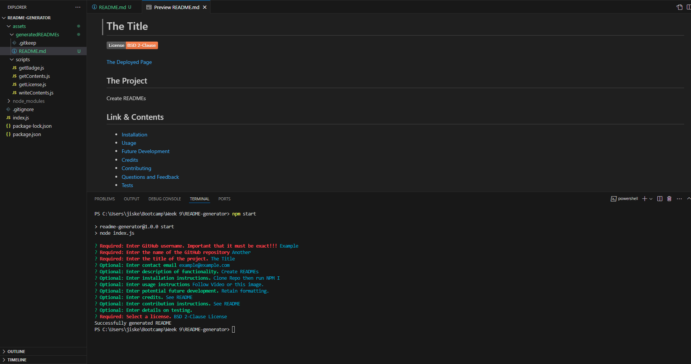

# README Generator

## The Project

This page was designed for a user to be able to input respond to a number of prompts with information regarding their project and then automatically generate a README containing the information they entered. Other features include:
- The ability to omit or skip entering certain sections and thus not generate them.
- Active links to deployed page, github repository etc based on the information entered.
- Minimal adjustment to final product outside the command line required outside of updating picture descriptions and filepaths.
- Colour coding to signify which prompts are optional and which are required.
- Checks to stop the code from continuing if required fields are incomplete.

## Link & Contents

- [Installation](#installation)
- [Usage](#usage)
- [Future Development](#future-development)
- [Credits](#credits)
- [Questions and Feedback](#questions-and-feedback)
- [License](#license)

## Image

## Installation

To install the generator all you need to do is follow these steps:
- Clone or fork the repository to your local machine.
- Open the folder in the console and run "npm i" to install dependencies.

## Usage

Following on from installation all you need to do to use the generator is:
- Enter either "npm start" or "node index.js" to initiate the generator.
- Enter all desired information. Note: Red required fields are mandatory.
- Navigate to the assets/generatedREADMEs folder to locate your new README.
- Open the file in an editor to update your image descriptions and file paths.
- Move the README to the root folder of the required repository or any other destination you wish.

[Or follow this video tutorial](https://app.screencastify.com/v3/watch/7Qut42fWXTlubOvv5JWV)

## Future Development

The number one thing for future development would be working out a way to keep formatting for data entered in prompts.
A few other ideas are having individual checks for each required field rather than having to resubmit everything if one is incomplete.
Adding functionality to automatically include filepaths to photos in a certain folder.

## Credits

Project set by edX/Monash University.Made use of the Xpert learning assistant, AskBcs and our instructor with troubleshooting issues.

Badges are from: https://shields.io

Screencastify for the demonstration video.

## Questions and Feedback

If you find any issues or have contributions or feedback you can do so by opening an [issue](https://github.com/Jiske-N/README-generator/issues) on Github.

Or through [email](example@email.com).

## License

MIT License

Copyright (c) 2024 Jiske-N

Permission is hereby granted, free of charge, to any person obtaining a copy of this software and associated documentation files (the "Software"), to deal in the Software without restriction, including without limitation the rights to use, copy, modify, merge, publish, distribute, sublicense, and/or sell copies of the Software, and to permit persons to whom the Software is furnished to do so, subject to the following conditions:

The above copyright notice and this permission notice shall be included in all copies or substantial portions of the Software.

THE SOFTWARE IS PROVIDED "AS IS", WITHOUT WARRANTY OF ANY KIND, EXPRESS OR IMPLIED, INCLUDING BUT NOT LIMITED TO THE WARRANTIES OF MERCHANTABILITY, FITNESS FOR A PARTICULAR PURPOSE AND NONINFRINGEMENT. IN NO EVENT SHALL THE AUTHORS OR COPYRIGHT HOLDERS BE LIABLE FOR ANY CLAIM, DAMAGES OR OTHER LIABILITY, WHETHER IN AN ACTION OF CONTRACT, TORT OR OTHERWISE, ARISING FROM, OUT OF OR IN CONNECTION WITH THE SOFTWARE OR THE USE OR OTHER DEALINGS IN THE SOFTWARE.
